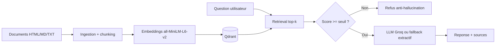

# AssistKB Search - Projet A

Assistant RAG de recherche/reponse sur base de connaissances avec Qdrant.
Objectif : repondre avec des sources et refuser quand l'information n'est pas dans le corpus.

## Architecture



## Lancer le projet

```bash
cp .env.example .env
# Optionnel mais recommande : mettre GROQ_API_KEY dans .env

docker compose up -d --build

docker compose run --rm api python -m app.embed
```

## Tester l'API

```bash
curl -X POST http://localhost:8000/ask \
  -H 'Content-Type: application/json' \
  -d '{"question":"Quelles mesures de securite sont recommandees pour les donnees personnelles ?","top_k":5}'
```

Question hors corpus attendue :

```bash
curl -X POST http://localhost:8000/ask \
  -H 'Content-Type: application/json' \
  -d '{"question":"Quelle est la capitale de l Australie ?","top_k":5}'
```

La reponse doit etre :

```json
{
  "answer": "Je ne dispose pas de cette information dans le corpus.",
  "sources": []
}
```

## Fichiers importants

- `app/ingest.py` : extraction HTML/TXT/MD et decoupage en chunks.
- `app/embed.py` : embeddings locaux avec `all-MiniLM-L6-v2`, puis indexation.
- `app/store.py` : adaptateur Qdrant.
- `app/retrieve.py` : recherche top-k.
- `app/generate.py` : seuil de refus + appel Groq + citations.
- `app/api.py` : API FastAPI avec `POST /ask`.
- `app/metrics.py` : metriques simples en memoire.
- `analytics/eval_topk.py` : mini-test top-k pour le compte rendu.

## Variables importantes

- `TOP_K=5` : nombre de chunks recuperes.
- `SEUIL_SIMILARITE=0.35` : seuil anti-hallucination.
- `GROQ_API_KEY` : cle LLM, optionnelle pour demo fallback.
- `QDRANT_URL=http://qdrant:6333` : URL du vector store dans Docker.

## Licence corpus

Les fichiers `corpus/seed` proviennent du sujet TP fourni. Les corpus externes ajoutes dans `corpus/raw` doivent respecter leur licence d'origine.
