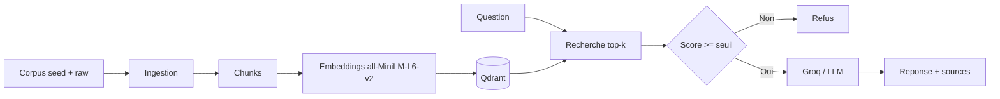

# Compte rendu - AssistKB Search

## 1. Presentation

Equipe : ...
Membres et roles :
- R1 Ingestion : ...
- R2 Embeddings / Qdrant : ...
- R3 Retrieval / Generation : ...
- R4 API / Docker / Metriques : ...

Projet choisi : A - AssistKB Search
Lien GitHub : ...

## 2. Objectif

Nous avons realise un assistant RAG qui permet de rechercher dans une base de connaissances AssistKB. L'utilisateur pose une question, le systeme retrouve les passages pertinents dans Qdrant, puis produit une reponse citee. Si aucun passage n'est suffisamment proche, l'assistant refuse de repondre afin d'eviter les hallucinations.

## 3. Architecture



## 4. Fonctionnement

1. Les documents HTML/MD/TXT sont lus dans `corpus/seed` et `corpus/raw`.
2. Ils sont decoupes en chunks avec overlap.
3. Chaque chunk est transforme en vecteur de dimension 384 avec `all-MiniLM-L6-v2`.
4. Les vecteurs sont stockes dans Qdrant.
5. Pour une question, le systeme calcule l'embedding de la question.
6. Qdrant retourne les top-k chunks les plus similaires.
7. Si le meilleur score est sous `SEUIL_SIMILARITE`, l'API retourne un refus.
8. Sinon, les chunks sont donnes au LLM, qui repond avec citations.

## 5. Structure du projet

```text
app/ingest.py      extraction et chunking
app/embed.py       embeddings + indexation
app/store.py       adaptateur Qdrant
app/retrieve.py    recherche top-k
app/generate.py    seuil de refus + generation
app/api.py         endpoint POST /ask
app/metrics.py     metriques simples
```

## 6. Choix techniques

- Vector store : Qdrant, choisi car c'est le store impose/recommande pour le projet A.
- Embeddings : `all-MiniLM-L6-v2`, modele local leger, rapide et compatible dimension 384.
- Chunking : environ 900 mots avec overlap de 150 mots pour conserver le contexte entre chunks.
- Seuil de similarite : `0.35` au depart, a ajuster selon les tests.
- Top-k : `5` au depart, bon compromis entre precision et quantite de contexte.

## 7. Resultats / metriques

A completer apres tests reels.

| Test | TOP_K | Seuil | Best score | Decision | Latence |
|---|---:|---:|---:|---|---:|
| Question dans corpus | 5 | 0.35 | ... | reponse | ... ms |
| Question hors corpus | 5 | 0.35 | ... | refus | ... ms |

Mini-comparaison top-k :

| TOP_K | Score moyen | Commentaire |
|---:|---:|---|
| 3 | ... | ... |
| 5 | ... | ... |
| 8 | ... | ... |

## 8. Difficultes et limites

- Le seuil depend fortement du corpus et doit etre calibre avec plusieurs questions.
- Sans cle Groq, le projet utilise un mode fallback extractif, moins naturel mais utile pour tester le retrieval.
- Le corpus raw n'est pas telecharge automatiquement dans ce starter ; il faut ajouter des documents ou completer `scripts/fetch_corpus.sh`.

## 11. Pistes d'amelioration

- Ajouter un reranker cross-encoder.
- Construire un golden dataset de 10 questions et mesurer le recall@k.
- Ajouter un monitoring plus complet des latences et des tokens.
