# Compte rendu - AssistKB Search

## 1. Présentation

Projet choisi : **Projet A - AssistKB Search**

Lien GitHub :https://github.com/barakissakone/Assistkb

Membres et rôles principaux :

- Yasmine : structure du projet, API et docker .
- David : ingestion du corpus, nettoyage des documents..
- Hamza :  Qdrant, stockage vectoriel et script d’évaluation.
- Hocine : embeddings, indexation, génération LLM et seuil de refus.

Même si chaque membre avait une responsabilité principale, le développement a été réalisé de manière collaborative. L’ensemble de l’équipe a participé aux choix techniques, aux tests, au débogage et à la compréhension globale du pipeline RAG.

## 2. Objectif du projet

L’objectif du projet AssistKB Search est de développer un assistant de recherche et de réponse basé sur une architecture RAG.

L’utilisateur pose une question en langage naturel. Le système recherche les passages les plus pertinents dans une base documentaire, puis génère une réponse en citant les sources utilisées. Lorsque l’information n’est pas présente dans le corpus, l’assistant doit refuser de répondre afin d’éviter les hallucinations.

Le point central du projet A est donc la qualité du retrieval : retrouver les bons passages, fournir des sources fiables et refuser proprement lorsque le corpus ne permet pas de répondre.

La formule de refus attendue est :

```text
Je ne dispose pas de cette information dans le corpus.
```

## 3. Architecture générale

```mermaid
flowchart LR
    Fetch[fetch_corpus.sh<br/>data.gouv / CNIL / CERT-FR] --> Raw[corpus/raw]
    Seed[corpus/seed<br/>corpus de départ] --> Ingest[Ingestion des documents]
    Raw --> Ingest

    Ingest --> Formats[HTML / TXT / MD / JSON / CSV / PDF]
    Formats --> Clean[Extraction et nettoyage du texte]
    Clean --> Chunks[Découpage en chunks<br/>avec métadonnées sources]

    Chunks --> EmbDoc[Embeddings documents<br/>all-MiniLM-L6-v2]
    EmbDoc --> Qdrant[(Qdrant<br/>vecteurs 384d)]

    User[Question utilisateur] --> API[POST /ask<br/>FastAPI]
    API --> EmbQuestion[Embedding de la question]
    EmbQuestion --> Search[Recherche top-k<br/>dans Qdrant]
    Qdrant --> Search

    Search --> Score{Meilleur score<br/>supérieur au seuil ?}

    Score -- Non --> Refus[Refus<br/>information absente du corpus]
    Score -- Oui --> Context[Construction du contexte<br/>chunks + sources]
    Context --> LLM[Groq / LLM]
    LLM --> Answer[Réponse citée<br/>avec sources]

    Refus --> Metrics[Métriques<br/>score / refus / latence / tokens]
    Answer --> Metrics
```



## 4. Fonctionnement du pipeline

Le fonctionnement est divisé en deux phases : l’indexation du corpus et la réponse aux questions.

### 4.1 Indexation du corpus

La phase d’indexation prépare les documents pour la recherche vectorielle.

1. Le script `scripts/fetch_corpus.sh` permet de récupérer des ressources publiques dans `corpus/raw`.
2. Le corpus seed présent dans `corpus/seed` est toujours indexé afin de garantir un fonctionnement hors ligne.
3. Les documents sont lus depuis `corpus/seed` et `corpus/raw`.
4. Les formats supportés sont : HTML, TXT, Markdown, JSON, CSV et PDF.
5. Le texte est extrait puis nettoyé.
6. Les documents sont découpés en chunks avec overlap afin de conserver du contexte entre les morceaux.
7. Chaque chunk est transformé en vecteur avec le modèle `all-MiniLM-L6-v2`.
8. Les vecteurs et leurs métadonnées sont stockés dans Qdrant.

La commande utilisée pour indexer le corpus est :

```bash
docker compose run --rm api python -m app.embed
```

Après récupération des ressources CNIL, l’indexation a permis d’obtenir 41 chunks dans Qdrant.

### 4.2 Réponse à une question

La phase de question-réponse est déclenchée par l’endpoint `POST /ask`.

1. L’utilisateur envoie une question à l’API FastAPI.
2. La question est transformée en embedding avec le même modèle que les documents.
3. Qdrant retourne les `top_k` chunks les plus proches.
4. Le meilleur score de similarité est comparé au seuil configuré.
5. Si le score est inférieur au seuil, l’API retourne la formule de refus.
6. Si le score est suffisant, les chunks récupérés sont transmis au LLM avec leurs sources.
7. Le LLM génère une réponse à partir du contexte fourni.
8. L’API retourne la réponse, les sources, le meilleur score, la latence et les tokens consommés.

## 5. Structure du projet

```text
app/ingest.py              extraction, nettoyage et chunking des documents
app/embed.py               génération des embeddings et indexation dans Qdrant
app/store.py               adaptateur Qdrant
app/retrieve.py            recherche top-k avec scores de similarité
app/generate.py            seuil de refus, fallback et génération LLM
app/api.py                 endpoints FastAPI : /health, /ask, /metrics
app/metrics.py             métriques de qualité et d’exploitation
scripts/fetch_corpus.sh    récupération de corpus publics
analytics/eval_topk.py     script d’évaluation top-k
```

## 6. Choix techniques

### 6.1 Qdrant

Qdrant est utilisé comme vector store. Il permet de stocker les embeddings des chunks et de rechercher rapidement les vecteurs les plus proches d’une question utilisateur.

Ce choix correspond à l’architecture attendue pour le projet A.

### 6.2 Modèle d’embeddings

Le modèle utilisé est :

```text
all-MiniLM-L6-v2
```

Ce modèle a été retenu car il est léger, rapide et exécutable localement. Il produit des vecteurs de dimension 384, ce qui est adapté pour un prototype RAG conteneurisé.

### 6.3 FastAPI

FastAPI est utilisé pour exposer le service RAG sous forme d’API HTTP.

Les endpoints principaux sont :

```text
GET  /health
POST /ask
GET  /metrics
```

Cela permet de tester facilement le service avec Swagger ou avec des commandes HTTP.

### 6.4 Groq / LLM

Groq est utilisé pour générer une réponse naturelle lorsque la clé API est configurée.

Si aucune clé n’est présente, le projet utilise un mode fallback extractif. Ce mode retourne les passages les plus pertinents sans appeler de LLM, ce qui permet de tester le retrieval même sans accès à un service externe.

### 6.5 Top-k

Le paramètre `top_k` définit le nombre de chunks récupérés dans Qdrant.

Un `top_k` trop faible peut manquer une source utile. Un `top_k` trop élevé augmente le contexte envoyé au LLM, ce qui peut ajouter du bruit, augmenter la latence et consommer plus de tokens.

La valeur retenue par défaut est :

```text
TOP_K = 5
```

### 6.6 Seuil de similarité

Le seuil de similarité permet de décider si le corpus contient une information suffisamment pertinente.

Si le meilleur score est inférieur au seuil, le système refuse de répondre. Ce mécanisme limite les hallucinations.

La valeur utilisée au départ est :

```text
SEUIL_SIMILARITE = 0.35
```

### 6.7 Limitation du contexte LLM

Lors des tests avec des PDF, certains chunks étaient volumineux. Une limitation du contexte envoyé au LLM a donc été ajoutée afin d’éviter de dépasser les limites du free tier Groq.

Le contexte est tronqué avant l’appel au LLM, et le nombre maximal de tokens générés est limité.

## 7. Corpus utilisé

Le corpus est composé de deux sources :

```text
corpus/seed
corpus/raw
```

Le dossier `corpus/seed` contient le corpus de départ versionné dans le projet. Il permet de tester le RAG même sans accès Internet.

Le dossier `corpus/raw` contient les ressources récupérées par le script `fetch_corpus.sh`. Ce dossier n’est pas versionné afin d’éviter de committer des fichiers externes ou volumineux.

Le script peut récupérer des ressources depuis :

- data.gouv ;
- CNIL ;
- CERT-FR.

Pour le projet A, le profil principal est :

```bash
PROFILE=open bash scripts/fetch_corpus.sh
```

Sous Windows avec Docker, le script peut être lancé avec :

```powershell
docker compose run --rm -e PROFILE=open api bash scripts/fetch_corpus.sh
```

Pour récupérer les guides CNIL au format PDF :

```powershell
docker compose run --rm -e PROFILE=cnil api bash scripts/fetch_corpus.sh
```

## 8. Résultats et métriques

### 8.1 Exemple de test dans le corpus

Question :

```text
Comment réduire les hallucinations dans AssistKB ?
```

Résultat observé :

| Élément | Valeur |
|---|---:|
| TOP_K | 5 |
| Meilleur score | 0.5544 |
| Décision | réponse avec sources |
| Latence | environ 9 s |
| Sources principales | incident hallucination, architecture AssistKB, guide CNIL |
| Tokens | prompt et completion non nuls |

Le système retrouve correctement le document lié à l’incident d’hallucination et génère une réponse sourcée.

### 8.2 Évaluation top-k

Le script `analytics/eval_topk.py` a été utilisé pour comparer plusieurs valeurs de `top_k`.

| TOP_K | Score moyen | Taux de refus | Latence moyenne | Tokens moyens | Tests OK |
|---:|---:|---:|---:|---:|---:|
| 3 | 0.4874 | 25.00 % | 2176 ms | 924 | 3/4 |
| 5 | 0.4874 | 50.00 % | 8060 ms | 912 | 4/4 |
| 8 | 0.4874 | 50.00 % | 9273 ms | 930 | 4/4 |

### 8.3 Interprétation

Le `top_k=3` est plus rapide, mais il obtient seulement 3 tests corrects sur 4. Il manque donc de contexte dans certains cas.

Le `top_k=5` obtient 4 tests corrects sur 4 avec une latence inférieure à `top_k=8`. Il constitue le meilleur compromis pour le MVP.

Le `top_k=8` obtient également 4 tests corrects sur 4, mais il augmente la latence sans améliorer le score moyen ni le taux de réussite.

Le score moyen reste identique car la métrique utilisée correspond au meilleur score retourné par Qdrant. Augmenter `top_k` ajoute des chunks supplémentaires, mais ne modifie pas nécessairement le meilleur chunk récupéré.

La valeur retenue pour le projet est donc :

```text
TOP_K = 5
```

## 9. Difficultés rencontrées

### 9.1 Fichiers PDF invalides

Certains fichiers récupérés depuis data.gouv portaient une extension `.pdf`, mais leur contenu réel commençait par du HTML. Ces fichiers n’étaient donc pas de vrais PDF.

Le pipeline détecte ce cas et ignore les fichiers invalides afin de ne pas bloquer l’indexation.

Les PDF  valides sont correctement lus, extraits et indexés.

### 9.2 Limites du free tier Groq

Avec les PDF, certains chunks peuvent contenir beaucoup de texte. Lors des tests, certaines requêtes dépassaient la limite de tokens du free tier Groq.

Pour corriger ce problème, le contexte transmis au LLM a été limité. Cette modification permet de stabiliser l’API et le script d’évaluation.

### 9.3 Calibration du seuil

Le seuil de similarité dépend fortement du corpus. Une valeur trop basse peut laisser passer des questions hors corpus. Une valeur trop haute peut refuser des questions pourtant présentes dans le corpus.

La valeur `0.35` a été utilisée comme point de départ et validée sur les tests réalisés.

## 10. Limites du projet

Le projet respecte les attentes principales du sujet, mais certaines limites restent présentes :

- le reranking cross-encoder n’a pas été implémenté car il était indiqué comme bonus ;
- le golden dataset de 10 questions/réponses n’a pas été formalisé ;
- le monitoring reste simple et basé sur des métriques internes ;
- l’API ne dispose pas encore d’interface utilisateur dédiée ;
- la qualité des réponses dépend directement de la qualité et de la couverture du corpus.

## 11. Pistes d’amélioration

Plusieurs améliorations peuvent être envisagées :

- ajouter un reranker cross-encoder afin de réordonner les chunks récupérés ;
- construire un golden dataset de référence ;
- mesurer le recall@k ;
- améliorer le nettoyage des ressources récupérées depuis data.gouv ;
- ajouter une interface web simple ;
- ajouter un tableau de bord de suivi des métriques ;
- améliorer la détection des fichiers invalides ou mal typés.

## 12. Conclusion

Le projet AssistKB Search met en place un pipeline RAG complet répondant aux exigences du projet A.

Le système permet d’ingérer un corpus hétérogène, de générer des embeddings, de stocker les vecteurs dans Qdrant, de rechercher les passages pertinents, puis de générer une réponse sourcée avec un LLM.

Le mécanisme de seuil de similarité permet de refuser les questions hors corpus et de limiter les hallucinations. Les métriques collectées permettent d’évaluer la qualité du retrieval ainsi que l’exploitation du service, notamment la latence et les tokens consommés.

Le choix final de `top_k=5` représente le meilleur compromis observé entre qualité des réponses, taux de refus correct et latence.
